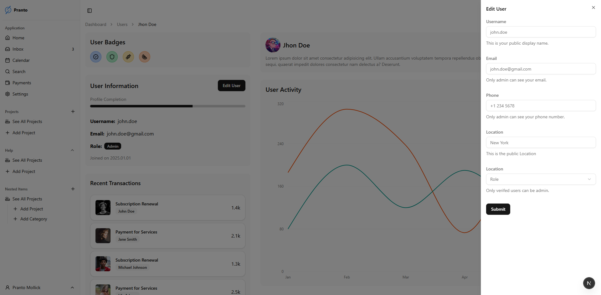

# Dashboard Project (dashboard-project-shadcn)

## Overview

This project is a customizable dashboard built using Next.js, React, and Tailwind CSS. It includes various UI components from Radix UI and Lucide icons for a modern look and feel.

## Features

-   **Dynamic Dashboard:** Easily configurable with drag-and-drop widgets.
-   **Responsive Design:** Fully responsive layout using Tailwind CSS.
-   **UI Components:** Integrated with Radix UI components like Avatar, Collapsible, Dialog, Dropdown Menu, Separator, Tooltip, and more.
-   **Icon Library:** Utilizes Lucide icons for graphical elements.
-   **Theme Support:** Integrated with Next.js Themes for easy theme management.

## Technologies Used

-   **Next.js**
-   **React**
-   **Tailwind CSS**
-   **Radix UI**
-   **Lucide**

## Screenshots Dark and Light Mode

### Dark Mode

-   Dashboard Page
    [](https://example.com)

-   User Page
    [](https://example.com)

-   User Input Form
    [](https://example.com)

-   Data Table Page
    [](https://example.com)

### Light Mode

-   Dashboard Page
    

-   User Page
    

-   User Input Form
    

-   Data Table Page
    

## Installation

1. Clone the repository:

```bash
git clone https://github.com/prantomollick/dashboard-project-app-shadcn
```

2. Install dependencies:

```bash
cd dashboard-project-app-shadcn
npm install
```

3. Run the development server:

```bash
npm run dev
```

4. Open `http://localhost:3000` in your browser.
